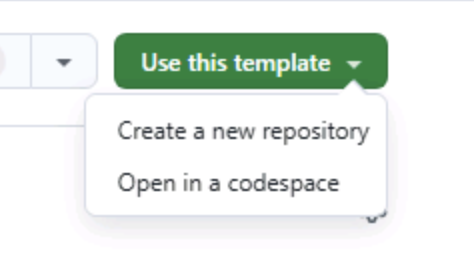
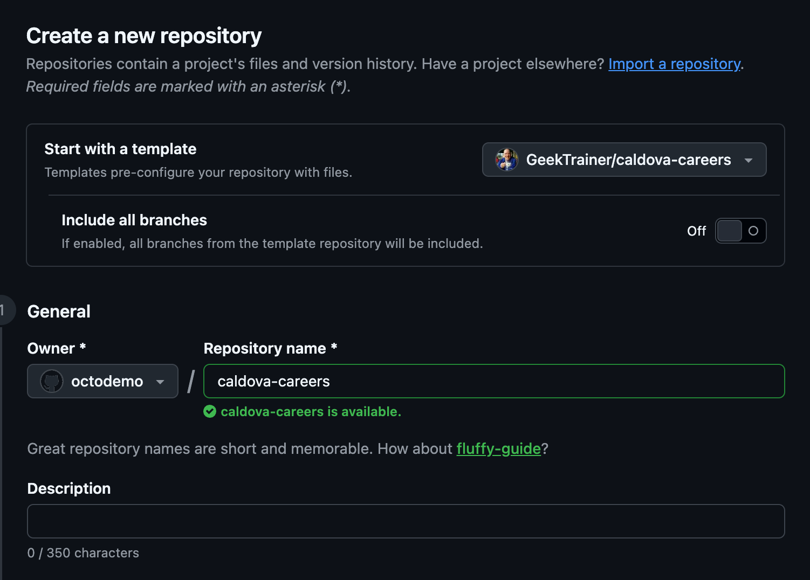
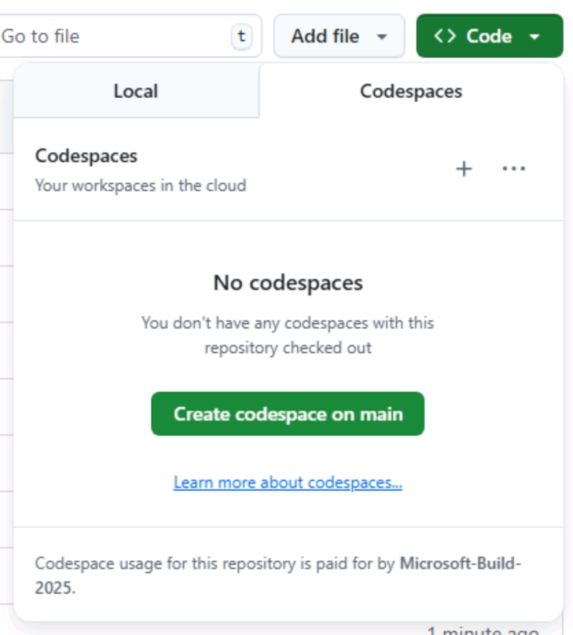

# Exercise 0: Prerequisites

Before you start the Copilot CLI exercises, you need to get everything ready. You'll create your own copy of the Caldova Careers repository and spin up a [codespace][codespaces], whose integrated terminal you'll use to install and run Copilot CLI in the next exercise.

## Setting up the lab repository

To create a copy of the repository for the code you'll create, you'll make an instance from the [template][template-repository]. The new instance will contain all of the necessary files for the lab, and you'll use it as you work through the exercises.

1. In a new browser window, navigate to the GitHub repository for this lab: `https://github.com/github-samples/caldova-careers`.
2. Create your own copy of the repository by selecting the **Use this template** button on the lab repository page. Then select **Create a new repository**.

    

3. If you are completing the workshop as part of an event being led by GitHub or Microsoft, follow the instructions provided by the mentors. Otherwise, you can create the new repository in an organization where you have access to GitHub Copilot.

    

4. Make a note of the repository path you created (**organization-or-user-name/repository-name**), as you will be referring to this later in the lab.

> [!NOTE]
> **Your backlog is ready**
>
> When you create your repository from the template, a short setup workflow runs automatically and files a backlog of GitHub issues for you — including the feature work you'll pick up in later exercises. You'll work from these issues throughout the workshop; there's nothing to file yourself. If the **Issues** tab looks empty immediately after creation, give the workflow a minute to finish and refresh.

## Creating a codespace

Next up, you'll use a codespace to complete the lab exercises.

[GitHub Codespaces][codespaces] are a cloud-based development environment that allows you to write, run, and debug code directly in your browser. It provides a fully-featured IDE with support for multiple programming languages, extensions, and tools.

1. Navigate to your newly created repository.
2. Select the green **Code** button.

    

3. Select the **Codespaces** tab and select the **+** button to create a new Codespace.

    

The creation of the codespace will take several minutes. Once it opens, prepare the application before continuing to the Copilot CLI exercises.

## Prepare the application

1. Open a terminal in your codespace using **Terminal** > **New Terminal**. Run the following commands from your learner repository's root.
2. Select Node.js 24 using the Node Version Manager included in the default Codespaces environment:

   ```bash
   nvm install 24
   nvm use 24
   ```

3. Install the application dependencies:

   ```bash
   npm install
   ```

4. Install Chromium and its system dependencies for the browser tests:

   ```bash
   npx playwright install --with-deps chromium
   ```

Keep the codespace open for the remaining exercises. When you start the application with `npm run dev` in Exercise 4, its `predev` script sets up the local database automatically.

> [!TIP]
> The setup workflow removes itself with a small commit after it files your backlog. If you created your codespace right away, run `git pull` in the codespace terminal once it's ready so you're on the latest commit before you start working.

## Summary

Congratulations, you have created a copy of the lab repository and prepared its dependencies in a codespace! You'll use this environment throughout the Copilot CLI exercises.

## Next step

Let's install Copilot CLI and authenticate it with your GitHub account. Continue to [Exercise 1 - Installing GitHub Copilot CLI][next-lesson].

## Resources

- [GitHub Codespaces overview][codespaces]
- [Creating a repository from a template][template-repository]
- [Getting started with Codespaces][codespaces-quickstart]

[template-repository]: https://docs.github.com/repositories/creating-and-managing-repositories/creating-a-template-repository
[codespaces-quickstart]: https://docs.github.com/codespaces/getting-started/quickstart
[next-lesson]: 1-install-copilot-cli.md
[codespaces]: https://github.com/features/codespaces
